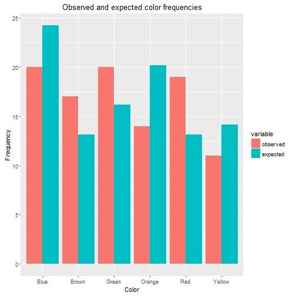

Shiny M&Ms
========================================================
author: Tom Tegtmeyer
date: Tue May 17 12:40:03 2016

Introduction
========================================================

A common introductory statistics class experiment involves using the color distribution of Milk Chocolate M&Ms candies to demonstrate the $\chi^2$ goodness-of-fit test. With this Shiny app, the user just inputs the M&M color frequencies and selects a level of significance for the goodness-of-fit test.

Using the App
========================================================

The user inputs the following:

- The frequency for each color.
- The level of significance for the $\chi^2$ goodness-of-fit test.

The app produces the following:

- A table with the observed and expected frequencies for each color, and each color's contribution to the total $\chi^2$ value.
- The $\chi^2$ value for the data.
- The P-value for the data, using 5 degrees of freedom.
- A conclusion to the goodness-of-fit test.
- A bar chart comparing the observed and expected values for each color.

Sample output
========================================================

<!-- html table generated in R 3.2.4 by xtable 1.8-2 package -->
<!-- Tue May 17 12:40:03 2016 -->
<table border=1>
<tr> <th>  </th> <th> color </th> <th> observed </th> <th> expected </th> <th> chisq </th>  </tr>
  <tr> <td align="right"> 1 </td> <td> Blue </td> <td align="right">  20 </td> <td align="right"> 24.24 </td> <td align="right"> 0.74 </td> </tr>
  <tr> <td align="right"> 2 </td> <td> Brown </td> <td align="right">  17 </td> <td align="right"> 13.13 </td> <td align="right"> 1.14 </td> </tr>
  <tr> <td align="right"> 3 </td> <td> Green </td> <td align="right">  20 </td> <td align="right"> 16.16 </td> <td align="right"> 0.91 </td> </tr>
  <tr> <td align="right"> 4 </td> <td> Orange </td> <td align="right">  14 </td> <td align="right"> 20.20 </td> <td align="right"> 1.90 </td> </tr>
  <tr> <td align="right"> 5 </td> <td> Red </td> <td align="right">  19 </td> <td align="right"> 13.13 </td> <td align="right"> 2.62 </td> </tr>
  <tr> <td align="right"> 6 </td> <td> Yellow </td> <td align="right">  11 </td> <td align="right"> 14.14 </td> <td align="right"> 0.70 </td> </tr>
   </table>

Total M&Ms = 101

Chi-squared = 8.019

P-value = 0.155

*There is not sufficient evidence to conclude that the color distribution does not match the assumed distribution.*

Sample output plot
========================================================

